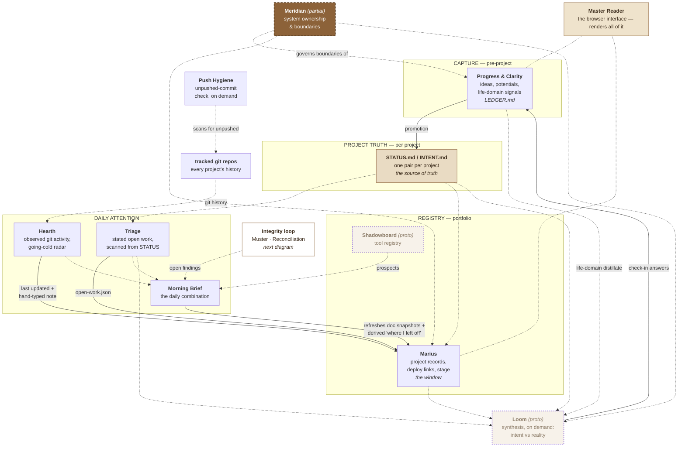
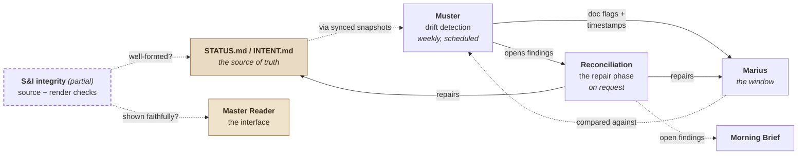

# The Ecosystem — A Guide

**A self-contained, portable explanation of how one person's project-and-idea
systems work together.**

Written 2026-09-25. Safe to share: no credentials, no account names, no
ledger content; examples are invented or generalized. Supersedes `PC-ECOSYSTEM-GUIDE.md`
(2026-07-30), which explained the same territory centered on one system,
Progress & Clarity. This version treats the whole set of systems, and how
they bound and hand off to each other, as the actual subject.

---

# §0 · For the AI assistant reading this

**You have probably been handed this file and asked a question about it. Read
this section, then jump only to the section you need.**

This document is a **depth ladder**. §1 is one paragraph. §2 is twelve lines.
§3 tells you where everything else is. Almost never read the whole thing
before answering — read §1–§4, then go directly to the section that answers
the question.

### If you are asked "what is this?" — this is the answer

> This describes a personal knowledge-and-project system built by one person,
> working across many unfinished projects with AI assistants that forget
> everything between sessions. It is not one tool but a set of small systems
> that each own a narrow job and hand off to one another: an upstream ledger
> for ideas that aren't projects yet, a truth-file pair for every real
> project, a portfolio registry that renders that truth, a daily attention
> routine built from two independent signals, drift-detection and repair
> routines that keep the registry honest, an on-demand synthesis pass that
> checks the whole thing still points at what the owner is actually trying to
> do, and a boundary registry consulted before any new system gets built, so
> two systems don't quietly start doing the same job. Most of these are in
> regular use; a few are only partly built, and two — the synthesis pass and
> the tool registry — are still early prototypes (§5.2 marks which). The organizing
> principle is that hand-written files are the truth and every dashboard,
> registry, or brief is just a window onto them. The hard part was never
> remembering or describing any of this — every piece above already does
> that well. The hard part is noticing, unprompted, when something in the
> world needs the owner's judgment, and saying so instead of staying quiet.
> That's solved in some pockets and unsolved at the edges — see §9.

Adapt the wording, keep the substance. If they want more, give them §2, not §5.

### How to answer well

1. **Answer the question asked. Don't dump the map.** Someone asking how an
   idea gets captured doesn't need the whole boundary table. This document is
   deliberately layered so you can stay shallow.
2. **Never describe a system as working when it isn't.** Before saying what
   any system does, check its **Lifecycle** in §5.2. A `Proto` system is
   designed but barely built; a `Partial` one is built but incomplete or not
   in regular use. Describing either as if it runs is the single most
   damaging mistake you can make with this document. That column is the
   *only* current-state claim this guide makes, and it is dated. Feature-level
   detail — whether a given capability inside a system has shipped — changes
   weekly and is deliberately not recorded here; this document was rewritten
   specifically because its predecessor tried to track it and went stale
   (§14). If you do have access to the owner's files,
   `Meridian/SYSTEMS_REGISTRY.md` is the live source the column is copied
   from, and wins over it.
3. **You probably cannot read the files this document names.** It references
   paths like `LEDGER.md`, `STATUS.md`, `SYSTEMS_REGISTRY.md`. Unless you've
   been given them, you have this document and nothing else. Say so rather
   than inventing contents.
4. **Don't produce unrequested multi-step plans.** This is a deliberate,
   hard-learned position that runs across every system described here (§10),
   not a quirk of one of them. If someone wants help moving something
   forward, name the smallest next action rather than filing a plan.
5. **This document is dated.** Roles and contracts don't age quickly; the
   lifecycle labels in §5.2 can. Treat them as of the date stamped on that
   table, and prefer a live source when you have one.
6. **Surface adjacent relevance sparingly.** §4 lists the cases where
   something *not* asked about is genuinely worth mentioning. Use it as a
   filter, not a prompt to volunteer everything.
7. **Don't reconstruct private content.** This document contains no ledger
   entries, credentials, or personal material, and you shouldn't guess at
   any. The systems it describes do hold genuinely personal material. If
   you're shown real ledger or project text elsewhere, don't quote it into
   anything meant to be shared.

---

# §1 · The one-paragraph version *(depth 1)*

A person working alone across many unfinished projects, with AI assistants
that forget everything between sessions, needs a handful of things: ideas
that don't evaporate before they're real, project truth that lives on disk
rather than in anyone's memory, a registry that can be looked at quickly
without becoming the truth itself, a daily habit of attention that doesn't
depend on remembering to check, and some way to notice when two sources of
truth have quietly started disagreeing. No single system does all of this —
that was tried, and it didn't hold. Instead there's a small set of systems,
each with one narrow job, wired together by a few consistent rules: files
next to the work are the truth; registries and dashboards only render what
those files say; nothing gets built before checking whether something
adjacent already owns the job. **Progress & Clarity** is the entry point for
ideas before they're real. **STATUS.md / INTENT.md** is the entry point once
they are. Everything else — the portfolio board, the daily brief, the drift
checks, the on-demand synthesis, the boundary registry itself — exists to
keep those files honest and to read them well, never to replace them.

---

# §2 · The twelve things that matter most *(depth 2)*

1. **Every real project has exactly one truth.** `STATUS.md` (what's true
   now, decisions, open work) and `INTENT.md` (why it exists), living next to
   the project. Nothing else is allowed to *be* the truth.
2. **Ideas that aren't projects yet don't get a project folder.** They live
   in Progress & Clarity's `LEDGER.md` — one permanent entry per idea,
   updated forever, never duplicated or renumbered.
3. **Registries render; they don't originate.** Marius shows the portfolio.
   If Marius and a project's `STATUS.md` disagree, the file wins — that's not
   a rare exception, it's the rule the whole design rests on.
4. **The daily read combines two independent signals on purpose.** Triage
   reads *stated* obligation (from `STATUS.md` open-work headings). Hearth
   reads *observed* activity (from git history). Morning Brief combines them
   because neither alone is trustworthy — stated work can be stale, activity
   can be busywork.
5. **Detecting drift and repairing it are deliberately two different
   routines.** Muster finds disagreements between the registry and the
   source docs; Reconciliation investigates and fixes them. Splitting them
   means the pass that notices a problem is never the same pass that decides
   how to resolve it.
6. **Check the boundary registry before building anything new.** Meridian
   exists for exactly one reason: to stop two systems from slowly starting to
   do the same job, disagreeing, and making the owner stop trusting both.
   This is the single most common way a system like this fails.
7. **The system flags; the human decides.** No routine here drafts an
   unrequested multi-step plan, silently reprioritizes, or resolves an
   ambiguous judgment call on its own. Where judgment is genuinely needed,
   the newer pattern is to stop and ask in the moment, not to guess and
   explain afterward.
8. **Generated files are regenerated, never edited.** If a generated view is
   wrong, its source or its generator is wrong — fix that, not the symptom.
9. **Promotion is the one hinge the whole thing turns on.** The moment an
   idea becomes a real project, it crosses from Progress & Clarity's world
   (permanent ledger entry) into the project-truth world (`STATUS.md` /
   `INTENT.md` plus a Marius record). Before that line, P&C owns it.
   After, the project's own files and Marius do.
10. **On-demand synthesis is different from daily attention, on purpose.**
    Loom is designed to ask "does the sum of the work still point at what the
    owner said he was trying to do?" — a question that daily tooling
    shouldn't try to answer, because forcing strategic reflection into a
    daily cadence is how it becomes background noise. Loom is still a
    prototype; the separation is settled, the tool is not.
11. **Detecting neglect is solved in pockets, not everywhere.** Hearth flags
    projects going cold. Progress & Clarity's newer fields flag ideas that
    are discussed often but never advance. Neither of those is the same
    problem as noticing that something *external* just happened and needs a
    decision — that one is still open. See §9.
12. **Not every system named here is fully built.** §5.2 gives each one a
    dated lifecycle label — Active, Partial, Proto — copied from the owner's
    boundary registry. Check it before describing what a system does. It is
    the only current-state claim in this document; everything else describes
    relationships, which change slowly.

---

# §3 · Routing — where to look for what *(the index)*

| If the question is… | Go to |
|---|---|
| "What is this?" / "Explain this system" | §0 answer, then §1, then §2 |
| "What are all these systems, and how do they fit together?" | §5 — the map (two diagrams: the flow, and the integrity loop) |
| "Who owns what? Where does one system's job end and another's begin?" | §6 — ownership and boundaries |
| "Where should this thing go?" | §6.4 — the placement table |
| "Two surfaces disagree — which is right?" | §7 — sources of truth |
| "How does [system] actually work, mechanically?" | §8 — one paragraph each, with a pointer to the real depth |
| "How do I capture an idea / add to one / ask for help / drop or finish one?" | §8.1 — using it |
| "Does my ecosystem notice things and tell me, or do I have to go looking?" | §9 — the live answer, as of this writing |
| "Why does it work this way instead of some simpler way?" | §10 — the design positions and the reasons behind them |
| "Something broke / a routine didn't do what I expected" | §11 — failure modes, written as symptoms |
| "What does *potential* / *sweep* / *Tier 0* / *S&I* mean?" | §12 — glossary |
| "I'm returning after a long gap" | §13 — quick-start orientations |
| "Should I build a new tracker/dashboard/routine?" | §6, then stop and check `Meridian/SYSTEMS_REGISTRY.md` before building |
| "Is this any good? Critique it" | §9 and §10 — the weak points are already named; don't rediscover them |

---

# §4 · Adjacency — what to surface without being asked

Use sparingly. These are the cases where the person is likely heading toward
a mistake or missing something load-bearing.

| If the conversation is about… | Worth surfacing |
|---|---|
| Capturing a new idea | §8.1 has the steps. Don't classify it at capture time. Deciding whether an idea is worth keeping is the friction that kills capture systems — a later batch process sorts it out. |
| Building a new tracker, dashboard, routine, or registry | Check `Meridian/SYSTEMS_REGISTRY.md` first. Something adjacent probably already owns it. |
| Whether a project is "done" | Most systems here have a stronger notion of *stalled* than of *finished*. Read the movement/activity history, not a status word. |
| Editing a file that might be generated | Generated views are regenerated, never edited. |
| Two dashboards showing different things | Neither dashboard is the truth. Find the source file each one claims to render, then apply §7. |
| A routine that "didn't change" after an edit | Some routines are canonical as a tracked file; others are canonical inside a scheduling app's own configuration, and the tracked copy is just a mirror. Check which, before assuming the routine is broken. |
| Daily priorities, "what should I do today" | That's a different system's job — the daily-attention layer (§5), not any single project's own files. |
| A plan for moving something forward | Producing an unrequested multi-step plan is an explicit, cross-system anti-pattern here (§10). Help name one falsifiable next action instead. |
| Anything touching deployment or public access | The ledger and project files hold genuinely personal material — habits, relationships, money. Public exposure is a serious defect, not a configuration detail. |
| Something that seems urgent but easy to miss (a quota warning, an expiring credential) | This ecosystem's current honest gap is exactly this category — see §9 before assuming something already catches it. |

---

# §5 · The system map *(depth 3)*

## 5.1 The shape of it

Work moves through roughly five layers: **capture** (ideas that aren't real
yet), **truth** (per-project source of fact), **registry** (a portfolio-wide
window onto that truth), **daily attention** (what a human should look at
today), and **integrity** (does the registry still agree with the truth). A
sixth, **synthesis**, runs on demand rather than continuously. A seventh,
**boundary governance**, sits outside the flow of work entirely and exists
only to be checked before any of the others changes shape.

The map is drawn as two diagrams: **the flow** of work from idea to daily
attention, and **the integrity loop** that keeps the registry and the source
files agreeing. They share two nodes — the project files and Marius.

**Reading both:** solid arrows are writes — one system changing another's
data. Dotted arrows are reads or checks. A dashed border marks a **Partial**
system, a faded one a **Proto** system (both also say so in the label); see
§5.2 for what those mean.

### The flow

### The integrity loop

**In prose, for renderers that don't draw the diagrams:**

Ideas enter at **Progress & Clarity**. If one becomes real it is *promoted* —
a project folder is created with its own `STATUS.md` and `INTENT.md`, and
**Marius** gains a record so the project is visible on the board.

From project `STATUS.md` files, **Triage** extracts open work and writes it
out for Marius to show as a project's "next actions." From the tracked git
repositories, **Hearth** reads what actually changed and what's going cold;
its going-cold warnings go into the daily brief, and it also updates each
project's last-updated date and hand-typed note in Marius. **Morning Brief**
combines Triage, Hearth, open Reconciliation findings, and new tool
candidates from Shadowboard into one daily read, and refreshes Marius's
copies of the project docs as it goes. From those copies, Marius derives a
project's "where I left off" — the newest dated entry in its own
`STATUS.md` — so, as of 2026-09-19, the board shows values read from the
source rather than trusting hand-typed ones to stay correct. **Push Hygiene** runs on demand
across the same repositories to catch commits that exist locally but were
never pushed — quiet git debt that neither Triage nor Hearth would otherwise
notice.

**Muster** compares the registry against synced copies of the project docs,
writes doc-presence flags and fixes pure-fact timestamp drift itself, and opens findings for everything
else; **Reconciliation** investigates those findings and repairs whichever
side is wrong — the registry, or the source docs. **S&I integrity routines**
check that source documents are well-formed and that the interface displays
them faithfully.

**Loom** — still a prototype — is designed to run on demand and do the one
thing nothing else does: read everything's *distillates* and ask whether the
sum of the work still points at what the owner said he was trying to do.

**Meridian** is the registry of which system owns what, consulted *before*
building anything new — it governs the boundaries of every registered
system in these diagrams, including itself (Master Reader and the git
repositories are a project and raw material, not registered systems).

**Master Reader** is the web interface through which nearly all of this
becomes readable.

## 5.2 One line each — and how built each one is

**Lifecycle as of 2026-09-25**, copied verbatim from the owner's boundary
registry (Meridian). This column is the one place this document states
current state; check it before describing what any system does.

| System | One line | Lifecycle |
|---|---|---|
| **Progress & Clarity** | Permanent memory for pre-project ideas and life-domain signals | Active |
| **STATUS / INTENT** | Per-project source of truth: why it exists, what's true now | Active |
| **Marius** | The portfolio registry and project board — the *window*, not the truth | Active |
| **Triage** | Scans STATUS files, extracts open work, curates a short daily list | Active |
| **Hearth** | Reads git history: what changed yesterday, what's going cold | Active |
| **Morning Brief** | Combines Triage + Hearth + open repairs + tool-registry prospects into one daily brief | Active |
| **Push Hygiene** | On-demand check for local commits that were never pushed, across every tracked repo | Active |
| **Muster** | Detects drift between the registry and the project docs | Active |
| **Reconciliation** | Investigates and repairs what Muster found | Active |
| **S&I Source Integrity** | Are the source docs themselves healthy and well-formed? | Partial |
| **S&I Render Integrity** | Is the interface showing the source docs faithfully? | Partial |
| **Loom** | On-demand synthesis: does the sum of the work still match the intent? | Proto |
| **Meridian** | Registry of system ownership and boundaries — check before building | Partial |
| **Shadowboard** | Tool registry: what's in use, what's blocked, what was dropped | Proto |
| **Master Reader** | The browser interface that renders nearly all of the above | — *(a project, not a registered system)* |
| **UX Playbook / Triangulate** *(adjacent)* | A parallel, design-taste-specific track: an evidence-backed canon of UI/UX rules and the audit method that feeds it. Governed by Meridian, but not part of the idea→project pipeline above. | Active / Active |

**What the labels mean** (Meridian's vocabulary): **Active** — currently used
or maintained. **Partial** — built but incomplete, still plausibly wanted.
**Proto** — specced or minimally instantiated, not truly built
yet. **Parked** — intentionally paused, probably resumable. **Shelved** — set
aside because context changed; not pending. **Deprecated** — retired; kept
only as history. None of the systems above is currently Parked, Shelved, or
Deprecated.

Active means the system exists and is maintained, not that every feature
inside it has shipped or that it runs on a schedule. By design, Muster runs
on its own weekly schedule and Morning Brief is the daily routine; Triage and
Hearth have no schedule of their own and run as steps inside Morning Brief;
everything else runs when asked. For feature-level detail, this document
points at each system's own `STATUS.md` rather than restating it.

---

# §6 · Ownership and boundaries — where the actual interaction lives

This is the part that matters most about an ecosystem rather than any one
piece of it: **not what each system does alone, but where two of them are
deliberately allowed to touch, and where that touching becomes a defect.**

## 6.1 The boundary table

| System | Owns | Explicitly does **not** own |
|---|---|---|
| **Progress & Clarity** | Pre-project ideas; the permanent ledger; life-domain signals | Active project tracking; daily focus; portfolio strategy; project metadata |
| **STATUS / INTENT** | Per-project purpose, current state, dated decisions, open work | Portfolio inventory; generated scans; strategic synthesis |
| **Marius** | Project records, deploy links, stage, board state | Project purpose and current state; daily focus; raw idea capture |
| **Triage** | Open-work discovery from STATUS files | Editing source files; strategic recommendations; drift detection |
| **Hearth** | Git-activity summary; going-cold radar | STATUS scanning; judgment about meaning |
| **Push Hygiene** | Ahead-of-remote / dirty-tree scan across every tracked repo | Git activity summaries (Hearth's job); auto-pushing without a wired credential and explicit go-ahead |
| **Muster** | Registry-vs-docs drift detection | Repairing judgment fields without approval; editing project STATUS files |
| **Reconciliation** | Verifying and repairing what Muster found | Detecting drift in the first place; daily brief curation |
| **Loom** | Intent-vs-reality synthesis; a ranked recommendation | Daily focus; project health audits; raw idea capture; scheduled review |
| **Meridian** | System boundaries, lifecycle, overlap warnings | Project inventory; project truth; automation |

## 6.2 Where overlap is intentional

- **Progress & Clarity and Loom both touch life domains.** Directional by
  design: P&C is the *upstream compressor*. Loom reads distillates only,
  never raw material — so when a domain would otherwise be invisible, the
  fix is to build a compressor for it, not widen what Loom reads directly.
  Loom may *collect* a life check-in when the last sweep is stale, and drops
  the answers into Progress & Clarity's inbox — only the sweep folds them
  into the ledger.
- **Progress & Clarity and Marius both describe things that could become
  projects.** The boundary is promotion: before it's real, P&C owns it;
  after, Marius and the project's own files do. The P&C entry survives as
  origin history, never deleted.
- **Triage and Hearth both feed the daily brief; Marius reads derived
  values instead of hand-typed ones.** One reads stated obligation, the
  other observed activity. As of 2026-09-19 Marius renders Triage's output
  as a project's "next actions," and derives "where I left off" from the
  newest dated entry in the project's own `STATUS.md`. Any hand-typed
  version of either field is shown as a labelled override, not a competing
  truth. This is the clearest live example of *how* two systems are meant to
  interact without corrupting each other: Marius consumes, it doesn't
  re-derive.
- **Muster and Reconciliation split detection from repair on purpose.** The
  pass that notices a disagreement is never the pass that decides how to
  fix it — collapsing them would blur exactly the judgment/mechanism line
  that matters most when something is wrong.

## 6.3 Where overlap is a defect — and where interruption belongs

- **A system growing a "today" view it wasn't built to have.** That's
  Morning Brief's job specifically; nothing else should quietly acquire it.
- **A registry ranking or prioritizing on the owner's behalf.** Registries
  render; synthesis (Loom) may recommend; only the owner decides.
- **The project board holding a project's state in prose instead of
  reading it.** Marius is a window. If it starts narrating instead of
  reflecting, the narration will eventually diverge from the file it's
  supposedly showing.
- **Any *new* dashboard that scans STATUS files.** Triage already does this.
  Meridian's system-creation guard exists specifically to catch this before
  it's built, not to clean it up after.
- **Interruption — the "tell me now" behavior — has no fixed home yet.**
  Some of it lives in Morning Brief (daily cadence), some in the newer
  human-review gate inside Progress & Clarity's own sweep (mid-process,
  when a judgment call can't proceed silently). Nothing currently owns
  interruption *between* those cadences — an event that happens at 2pm on a
  Tuesday and genuinely can't wait for tomorrow's brief. That gap is real
  and current; see §9.

## 6.4 Where does this belong?

The practical form of the boundary table: given a thing, where it goes.

| If it is… | It goes in… |
|---|---|
| An idea that isn't a project yet | **Progress & Clarity** — capture it (§8.1) |
| A real project's current state, or a decision made about it | that project's **`STATUS.md`**, as a dated What / Why / How-to-apply entry |
| A real project's purpose | that project's **`INTENT.md`** |
| Something that needs doing on a real project | an open-work heading in that project's **`STATUS.md`**. Triage finds it from there; never add it to a daily list directly |
| A deploy link, stage, or board position | **Marius** |
| A tool being adopted, dropped, or paid for | **Shadowboard** *(Proto)* |
| A design rule that has proven itself across projects | **UX Playbook**, via its Triangulate method |
| A question about direction across everything | **Loom** *(Proto)* — raise it with the owner; don't expect a standing report |
| A new system, routine, dashboard, tracker, or registry | **Meridian first** — check what already owns the job |
| A generated view that's wrong | its **source or its generator** — never the view itself |

**Quick test between Progress & Clarity and a project:** *does this thing
have a project folder?* If yes, its `STATUS.md`. If no, Progress & Clarity.

---

# §7 · Sources of truth

**Read this section when two surfaces disagree.**

| Layer | Examples | Authority |
|---|---|---|
| **Canonical files** | `LEDGER.md`, project `STATUS.md` / `INTENT.md`, `Meridian/SYSTEMS_REGISTRY.md` | **Highest.** Hand-maintained; changes here are the real changes. |
| **Generated / synced views** | Triage output, Marius's derived fields, index files, roll-ups | **None.** Regenerate; never edit. If one is wrong, the source or the generator is wrong. |
| **Dated narrative artifacts** | sweep snapshots, drift reports, synthesis reports, daily briefs, **this document** | **Historical.** True as of their date. Never current state. |
| **Browser-local state** | pending notes, unpublished annotations | **Fragile.** One browser only, until published. Invisible to every routine until then. |
| **Transport artifacts** | signals files, trigger issues, commits | **In-flight.** Meaningful only between publish and integration. |
| **Routine instructions** | a scheduled routine's behavioral spec | **Split** — some are canonical as a tracked file; others are canonical only inside the scheduling app's own configuration, and the repo copy is a mirror that does nothing until a human re-pastes it. Check which before assuming an edit took effect. |

**Resolution procedure, in order:** identify each side's layer — a generated
view losing to a canonical file isn't a conflict, it's a stale regeneration.
Prefer the canonical file. If both are canonical, prefer the one whose scope
owns the fact (§6). If both claim ownership, that's a boundary defect —
record it, don't silently pick. Then record the resolution as a dated entry
in the affected `STATUS.md`, so the next reader doesn't re-derive it.

---

# §8 · How each piece actually works *(one paragraph each — go to the source for real depth)*

This document deliberately does not carry full mechanics for any one system.
Duplicating another file's detail here would create a second copy that can
drift from the first — exactly the failure mode §6 and §10 warn against.
Each entry below is enough to understand the system's role; its own
`STATUS.md` / `INTENT.md` (or, for Meridian, `SPEC.md`) is the real depth.

- **Progress & Clarity.** A batch process called a *sweep* reads the ledger
  in full plus whatever new input has arrived (voice notes, annotations,
  periodic check-ins), folds it into permanent per-idea entries, writes a
  dated snapshot, and archives the raw input so it's never re-read. Only the
  sweep integrates anything into the ledger. One narrow exception: when a
  plan is worked out in conversation after a sweep, a single dated pointer
  line may be added to that entry early, so the plan is visible before the
  next sweep folds it in properly. A newer human-review gate can pause the sweep
  mid-batch and ask the owner directly when an item is genuinely ambiguous,
  rather than guessing or silently skipping it. Full mechanics:
  `Master-Reader/progress-clarity/STATUS.md` and `INTENT.md`.
- **STATUS / INTENT.** No process at all — a human or an assistant edits
  these files directly as work happens. `STATUS.md` carries dated decisions
  (what / why / how to apply) and open-work headings; `INTENT.md` rarely
  changes. Everything downstream treats edits to these files as the actual
  change, not a report about one.
- **Marius.** A hand- and script-maintained data file rendered as a board.
  As of 2026-09-19 its "next actions" come from Triage's generated output
  and its "where I left off" is derived from the newest dated entry in each
  project's `STATUS.md`, rather than typed by hand; any hand-typed value is
  shown as a labelled override rather than silently replaced.
- **Triage / Hearth / Morning Brief.** Triage parses every tracked
  `STATUS.md` for open-work headings into a short daily list. Hearth reads
  git log across tracked repos for what changed and what's gone quiet.
  Neither has a schedule of its own: Morning Brief runs both as steps, plus
  a check of open Reconciliation findings and tool-registry prospects, and
  combines them into one read.
- **Muster / Reconciliation.** Muster runs weekly on a schedule, compares Marius
  against the S&I files it claims to reflect, and writes dated findings —
  including auto-correcting pure-fact timestamp drift with no finding
  needed. Reconciliation is a separate pass, run on request rather than on a
  schedule, that investigates each open finding, confirms current reality,
  and either repairs it or asks the owner when the fix requires judgment.
- **S&I Source / Render Integrity.** Two audit routines: one checks that the
  `STATUS.md` / `INTENT.md` files themselves are well-formed and consistent,
  the other that the interface displays them faithfully. Both report in
  conversation and fix nothing without approval. Built, but run only by hand
  and not recently — hence Partial.
- **Push Hygiene.** An on-demand scan across every repo in a tracked list for
  local commits ahead of their remote, or dirty working trees — run when
  there's spare time at the end of a day, not on a schedule.
- **Loom.** *(Proto.)* Designed to read distillates — not raw material —
  from Progress & Clarity, Marius, STATUS files, and Triage, and produce a
  dated, ranked recommendation about whether the portfolio's direction still
  matches stated intent. Runs only when explicitly asked. Its boundaries are
  settled; the tool itself is still a prototype, so don't describe its output
  as something the owner routinely gets.
- **Meridian.** A short, hand-maintained registry: one entry per system, with
  its purpose, what it owns, what it explicitly doesn't, a lifecycle state,
  and a rule for when it should be surfaced in conversation at all. Consulted
  before any new cross-project structure is built. *(Partial:* the registry
  and the check-before-building rule are in use; parts of its broader design
  are not yet built. The check is a standing instruction to assistants, not
  an automated gate.)
- **Master Reader.** A single-file browser interface plus a handful of small
  serverless functions. It renders markdown and layers small interactive
  affordances on top (annotations, publish buttons); it never writes a
  canonical file directly — every write goes through the routine that owns
  that file.

## 8.1 Using it — the things people actually do

- **Capture an idea.** Say or type it, save it as a markdown file, and put
  it in Progress & Clarity's inbox — the interface's upload button, or the
  input folder directly. Don't classify it, name a category, or decide
  whether it's worth keeping; the next sweep creates or updates the entry.
  Deciding at capture time is the friction that kills capture systems.
- **Add to an idea already tracked.** Mention it in a new note — the sweep
  matches by name or clear topic and appends to the existing entry rather
  than creating a duplicate — or use the entry's note control in the
  interface.
- **Ask for help thinking one through.** Use the entry's plan control. The
  next sweep answers with a few probing questions, not a drafted plan; the
  real thinking happens in conversation afterward.
- **Drop, restore, or finish one.** Drop with the entry's delete control,
  ideally with a note saying *why*. Restoring a dropped entry revives the
  same permanent record, never a duplicate. There is **no "done" state**:
  finished ideas are dropped with a note saying they were completed rather
  than abandoned.
- **One caveat that matters today:** notes written in the interface live in
  that one browser until they're published. Publish, confirm it reported the
  count you expected, *then* run a sweep — and don't write new notes while a
  sweep is pending. "Parking" an entry only hides it in your own browser;
  the sweep never sees it.
- **Record project truth.** Edit the project's `STATUS.md` directly. That
  edit *is* the change; nothing downstream needs telling.
- **Build something new.** Check Meridian first (§6.4, last rows).

---

# §9 · The self-maintenance question — what's solved, what isn't

This is the part most worth reading carefully, because it's the actual
answer to *"does this notice things and tell me, or do I have to keep
checking it myself?"*

**Solved:** disagreement between a registry and its source. Muster finds it
on a weekly schedule, without the owner having to go looking; findings queue
until Reconciliation — run on request — verifies and repairs them. Detection
is automatic; repair is one deliberate step.

**Solved:** a project quietly going cold. The board's derived "where I left
off" shows the date of the project's newest dated `STATUS.md` entry — or says
there's none in the last 60 days — and Hearth's going-cold warning names
silent projects in the daily brief. Staleness is visible without having to
remember to suspect it.

**Partially solved:** an idea that gets *talked about* without ever
*advancing*. Progress & Clarity's ledger historically conflated "recently
discussed" with "moving" — the same status field measured both, so an idea
mentioned four times with zero real-world action read as active. As of
2026-08, every ledger entry carries additive `Observed` / `Advanced` /
`Reviewed` dates, so the gap between "talked about" and "moved" is now
*recorded* — and visible to anyone reading the ledger. An at-a-glance
indicator for it in the interface has been written but is not yet
deployed. A fuller model — separating the owner's stance
toward an idea from how far it's actually advanced, with escalation after a
set number of days or mentions with no real movement — is designed and
deliberately not yet built, specifically so the simpler version gets real use
first before more judgment logic is added on top of it.

**Not solved: something external happens and nobody routes it to attention.**
The clearest live example, found during a routine review: warning emails
about a hosting quota nearing its limit and access keys approaching expiry
arrived correctly and sat unread for days — not because the warnings
failed, but because *nothing in this ecosystem reads a mail inbox at all*. The alerting worked; there was no
routine whose job it was to notice the alert existed. This is currently an
open, named design question — not a duplicate of anything above, since
Meridian's own boundary check confirmed no existing system touches email —
with the real design questions still unresolved: what counts as actionable
versus routine noise, whether it should be read-only or allowed to act
(label, archive), and deciding that read/write boundary *before* building
anything, given this ecosystem's standing rule that automation never acts
without a prior yes.

**The general pattern, if you're asked to design the fix for any of this:**
every mechanism above that "notices" something does it by comparing two
already-internal sources of truth against each other (registry vs. source
file, ledger mention vs. ledger advancement date). None of them yet reasons
about a *single external event* and decides whether it's worth interrupting
someone over. That's a harder problem than drift detection — it needs a
notion of urgency, not just a notion of disagreement — and nothing here
claims to have solved it yet.

---

# §10 · The design positions worth understanding

Not rules — *reasons*. If you're asked to critique or extend anything above,
these are what a good suggestion has to survive.

**Written truth lives next to the thing it describes.** Files beside the
work; dashboards read them. Any proposal where a dashboard becomes
authoritative is a regression, not an upgrade.

**Nothing is lost, but context stays bounded.** Permanent records, updated
never duplicated; raw source archived and never re-read once processed.
That's what keeps memory small enough to stay trustworthy as it grows over
years. Any proposal that requires re-reading history at scale breaks it.

**Preserving context is not enough on its own.** A system can capture an
idea perfectly, describe it beautifully, remember it for a year — and leave
it exactly as unrealized as the day it was captured. Memory without a
feedback loop between "this matters" and "something happened" produces
better documentation, not better outcomes. See §9.

**The system flags; the human decides.** Nothing here advises unasked,
editorializes about whether an idea is realistic, or turns a request for
help into a drafted plan instead of a question. A more assertive system
would be used less, not more.

**Don't add a surface; extend an adjacent one.** Every new dashboard, tracker,
or registry is another thing that can disagree with the others. The guard
is a standing rule — check the boundary registry *before* building — that
assistants are instructed to follow; it is not an automated gate. It works
by preventing overlap, not by cleaning it up after the fact.

**A synthesis document about the ecosystem should describe roles and
contracts, plus only the slowest-changing current state — never feature-level
status.** This guide exists because its predecessor didn't hold to that line:
it embedded an 18-row table of which *capabilities* were "live vs. proposed,"
accurate the day it was written and wrong within six weeks. The opposite
extreme fails too — a portable document that only points at the owner's
files leaves an outside reader unable to tell a working system from a
prototype. The compromise: one lifecycle label per *system* (§5.2), copied
verbatim from the boundary registry, dated, with a named refresh trigger
(§11). Whole-system lifecycle changes on the order of months; capability
status changes weekly. That difference is the bet (§14).

---

# §11 · Failure modes, written as symptoms

### "A routine's behavior didn't change after I edited its file"

**Routine drift.** The file may be a mirror rather than the runnable source —
check which category it's in (§7) before concluding the routine is broken.

### "The dashboard shows something the project docs contradict"

**Stale generated view.** Regenerate, never edit. Still wrong afterward? The
source or the generator is wrong — that's Muster's job to detect and
Reconciliation's to repair.

### "Everything looks active but nothing has shipped"

**False momentum.** Read the actual movement/activity history rather than a
status word, and ask of each entry whether it describes something that
happened or something that was said (§9).

### "I built a new tracker and now two things disagree"

**Boundary creep.** Check `Meridian/SYSTEMS_REGISTRY.md` *before* building.
If something adjacent already owns the function, extend or route to it
instead. This failure mode compounds — each new surface makes the next
disagreement harder to resolve.

### "Something important sat there for days and nobody flagged it"

**The open gap, not a bug.** See §9. As of this writing there is no routine
whose job is noticing an external event and deciding it's worth interrupting
someone over. Don't assume one exists just because everything nearby looks
well-instrumented.

### Maintenance cadence

| When | Do |
|---|---|
| A structural decision gets made anywhere | Dated What / Why / How-to-apply entry in that project's own `STATUS.md`, in the same session the decision is made — not deferred to later |
| Before building any new system, routine, or cross-project surface | Check `Meridian/SYSTEMS_REGISTRY.md` |
| Weekly (scheduled) | Muster; then Reconciliation, on request, for what it finds |
| When any system's lifecycle changes in `Meridian/SYSTEMS_REGISTRY.md` | Update §5.2's Lifecycle column and its date stamp, and move the node between the `partial` / `proto` classes (and its label) in both §5.1 diagrams, in the same session — the column is copied from the registry, never edited independently |
| Ad hoc, end of a work session | Push Hygiene, so a day never leaves quiet git debt |
| When this document's own §9 or §6 stops matching reality | Rewrite the affected section and log the rewrite in this file's own history — don't let a second synthesis document quietly go stale the same way the first one did |

---

# §12 · Glossary

| Term | Meaning |
|---|---|
| **Potential** | An idea, ambition, habit, or system idea tracked in Progress & Clarity. The atomic unit there. |
| **Ledger** | `LEDGER.md` — Progress & Clarity's canonical memory. One permanent entry per potential. |
| **Sweep** | The batch process that folds new input into the ledger, writes a snapshot, archives the input. The only thing that integrates input into the ledger (a plan follow-up may leave one pointer line early; §8). |
| **Publish** | Sending notes written in the interface out of the browser into Progress & Clarity's inbox, so the next sweep can read them. Until then they exist in one browser only. |
| **Park / back burner** | Hiding an entry from the default view. Currently a browser-only display setting; the sweep never sees it. |
| **Promotion** | The handoff when a potential becomes a real project: a project folder with `STATUS.md`/`INTENT.md`, a record in Marius, the P&C entry retired as an origin record. |
| **S&I** | Shorthand for the `STATUS.md` / `INTENT.md` pair every real project carries. |
| **Tier 0** | Meridian's term for the small set of durable, cross-cutting systems worth a registry entry at all — as opposed to a one-off script or a single project's internal tooling. |
| **System class / Lifecycle / Surface rule** | Meridian's three-part metadata per system: what kind of thing it is, how built and alive it currently is (Active / Partial / Proto / Parked / Shelved, plus Deprecated for retired systems — defined under §5.2), and when it should actually come up in conversation. |
| **Muster / Reconciliation** | The drift-detection and drift-repair pair — deliberately separate routines, never merged. |
| **Loom** | On-demand portfolio synthesis: intent versus observed reality, plus a ranked recommendation. Formerly named Big Picture. |
| **Canonical file / Generated view** | A hand-maintained source of truth, versus a file a script or routine produces. The latter is regenerated, never edited. |
| **Push Hygiene** | The on-demand, every-repo check for local commits that were never pushed. |
| **Boundary creep** | Two systems slowly starting to do the same job, disagreeing, and eroding trust in both. The failure mode Meridian exists to prevent. |

---

# §13 · Quick-start orientations

### "I want to understand the ecosystem."

§1, then §2, then §5. Fifteen minutes gets you to competent. One-sentence
version: **ideas live in a permanent ledger until they become projects;
projects carry their own truth in two files; everything else is either a
window onto those files, a routine that checks they're honest, or a boundary
rule that stops a new window or routine from duplicating one that already
exists.**

### "I want to know what's real and current, right now."

- Whether a system is built at all → the Lifecycle column in §5.2 (dated);
  if you have the owner's files, `Meridian/SYSTEMS_REGISTRY.md` is fresher.
- Whether a specific feature inside a system has shipped → that system's own
  `STATUS.md`; this document deliberately doesn't track it.
- A specific project's state → that project's own `STATUS.md`.
- What's open today → the daily brief's output.
- Pre-project ideas → Progress & Clarity's `LEDGER.md`.
- When two surfaces disagree → §7.

### "I want to capture something."

§8.1. Say it, save it as markdown, put it in the inbox. Don't classify it.
Not sure it belongs in Progress & Clarity at all? §6.4's quick test.

### "I think two surfaces disagree."

§7, in order. Most common causes, in frequency order: a generated view
wasn't regenerated; a routine file was edited but the runnable copy wasn't
synced; a dated report is being read as current state; local unpublished
state never reached the canonical file.

### "I'm coming back after months away."

§2 for the facts, §9 for what's actually solved right now, then the relevant
project's own `STATUS.md` for current state. Don't trust this document's
dated claims over a `STATUS.md` — this is a periodic synthesis; that's
maintained continuously.

---

# §14 · Related documents and document status

| Document | Job |
|---|---|
| `Master-Reader/progress-clarity/LEDGER.md` / `STATUS.md` / `INTENT.md` | The deep dive on Progress & Clarity specifically |
| `Meridian/SYSTEMS_REGISTRY.md` | The continuously-maintained lifecycle registry — the authority on what's currently Active, Partial, or Proto; §5.2's column is a dated copy of it |
| `Master-Reader/SYSTEMS-GUIDE.md` | A shorter, internal, second-person operations cheat-sheet for the STATUS/Marius/Triage/Hearth/Muster cluster specifically — a different audience than this file, not a competing version of it |
| `Master-Reader/progress-clarity/PC-ECOSYSTEM-GUIDE.md` | **Superseded by this file** as of 2026-09-25. Now carries a short pointer rather than the full text. |
| **This file** | The comprehensive, portable, whole-ecosystem explanation and routing layer |

This guide replaces none of the source files above on a factual question.
Where they disagree with it on current state, **they win** — they're
maintained continuously; this is a periodic synthesis.

**Document status: Live.** Written 2026-09-25, replacing the P&C-centered
`PC-ECOSYSTEM-GUIDE.md` (2026-07-30) after a review found its embedded
"what's live" table had gone stale within six weeks despite the source
document's own commitment to keep it current. This version's structural bet
has two parts: name relationships and point at continuously-maintained
sources for feature-level facts, and carry exactly one dated current-state
claim — the per-system Lifecycle column in §5.2 — because an outside reader
has no other way to tell a working system from a prototype. That bet should
be reassessed the next time this file is read for a "critique this"
question: if the column's date is months old, or a label disagrees with the
registry, say so plainly rather than defending the design.

**Rules for editing this file.** It is meant to be published.
- Never add a token, credential, account or service login name, email
  address, ledger excerpt or entry ID, or anything personal about the owner.
- Examples must be invented or generalized. When a real event illustrates a
  point, keep the lesson and drop the specifics (which provider, which key).
- Before every public push, check for: email addresses; key-like strings
  (`ghp_`, `sk-`, `Bearer`, long random tokens); ledger IDs (three capital
  letters, a hyphen, two digits); names of the owner's individual projects;
  absolute home-directory paths. Then hand-read §9 and this History list —
  the two places real events get described.

**History.**
- 2026-09-25 — Written.
- 2026-09-25 — Added the §5.2 Lifecycle column and aligned §0, §2, §8, §9,
  §10, §11, §12, §13 with it, after a review found that pointing only at
  `Meridian/SYSTEMS_REGISTRY.md` left public readers (who can't open it)
  unable to distinguish live systems from prototypes. The two S&I integrity
  routines were registered in Meridian first so every row could be copied
  rather than invented.
- 2026-09-25 — Added §6.4 (where things belong) and §8.1 (using it), with
  routing rows in §3, §4, §12, §13. §8.1 describes the committed, deployed
  behavior — including the browser-only caveats — not the pending
  note-safety work, which was found to be uncommitted. Corrected §9, which
  had described that work's interface indicator as live.
- 2026-09-25 — Corrected the §5.1 map against the routine files: removed
  Push Hygiene → STATUS (it scans git repos, now a shared node with
  Hearth); added Reconciliation → Marius (it repairs either side), Muster →
  Marius (timestamp auto-fix), Morning Brief → Marius (snapshot and activity
  refresh), and Reconciliation / Shadowboard → Morning Brief. Solid arrows now
  mean writes and dotted mean reads; Partial and Proto systems are marked on
  the diagram. Prose version and §5.2's Morning Brief line updated to match.
  Split into two diagrams — the flow, and the integrity loop — because the
  corrected write-backs into Marius made a single diagram unreadable.
- 2026-09-25 — Privacy pass for publication: restored the editing rules
  (above) and the §4 public-access row, added §0 rule 7, generalized §9's
  real example, removed the owner's name, and corrected the header's
  safety claim, which had said "invented examples throughout" while §9
  described a real event.
- 2026-09-25 — Grounding check against code and routine files: "where I
  left off" is derived from each project's newest dated `STATUS.md` entry,
  not from Hearth (corrected in the flow diagram, §5.1, §6.2, §8, §9); added
  Loom's check-in write into Progress & Clarity; widened Muster's write
  label; narrowed "only the sweep writes the ledger" to its real exception;
  stated which routines have their own schedule.
