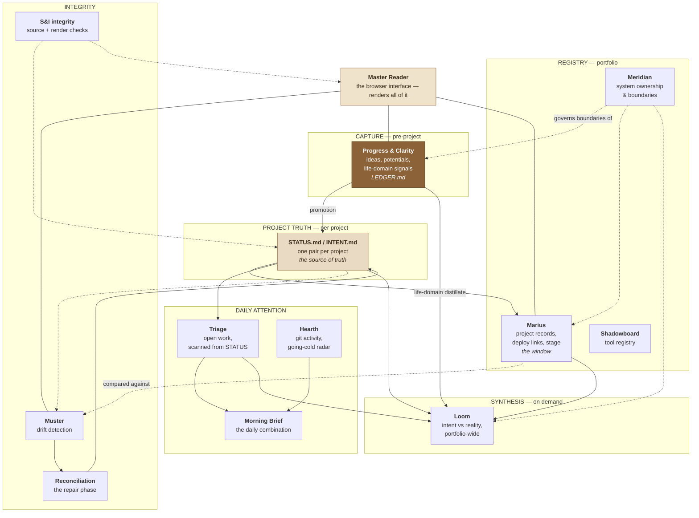
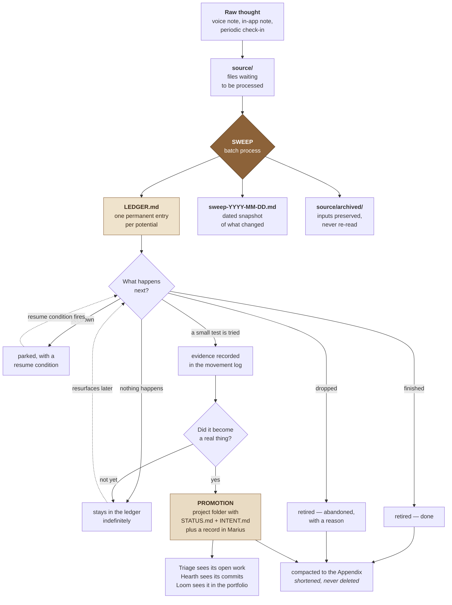

# Progress & Clarity — Ecosystem Guide

**A self-contained, portable explanation of P&C and the systems around it.**

Written 2026-07-30. Safe to share: no credentials, no personal content, invented
examples throughout.

---

# §0 · For the AI assistant reading this

**You have probably been handed this file and asked a question about it. Read
this section, then jump only to the section you need.**

This document is organized as a **depth ladder**. §1 is one paragraph. §2 is ten
lines. §3 tells you where everything else is. You should almost never read the
whole thing before answering — read §1–§4, then go directly to the section that
answers the question.

### If you are asked "what is this?" — this is the answer

> This describes a personal knowledge-and-project system built by one person to
> work with AI assistants across many unfinished projects. Its core piece,
> **Progress & Clarity (P&C)**, is a permanent memory for ideas that aren't
> projects yet: every idea gets one entry in a single ledger file, forever, and a
> batch process called a **sweep** folds new voice notes and annotations into it.
> Around P&C sit other systems that handle work once it becomes real — per-project
> truth files, a project registry, a daily attention routine, drift-detection
> routines, and a synthesis routine. The organizing principle is that
> hand-written files are the truth and every dashboard is just a window onto
> them. The system's known live weakness, and the thing it is currently being
> redesigned to fix, is that it's excellent at *remembering* ideas and has no
> mechanism for noticing whether they ever *advance*.

Adapt the wording, keep the substance. If they want more, give them §2, not §5.

### How to answer well

1. **Answer the question asked. Don't dump the map.** Someone asking how to
   capture an idea does not need the system inventory. This document is
   deliberately layered so you can stay shallow.
2. **Distinguish live from proposed.** Sections are marked. §12 is a
   consolidated table of what's real versus what's only designed. Asserting
   proposed behavior as real is the single most damaging mistake you can make
   with this document — check §12 before describing any capability.
3. **You probably cannot read the files this document names.** It references
   paths like `LEDGER.md` and `STATUS.md`. Unless you've been given them, you
   have this document and nothing else. Say so rather than inventing contents.
4. **Don't produce unrequested multi-step plans.** This is an explicit,
   hard-learned anti-pattern in this system (see §9.4 and §11). A plan filed in a
   document is not planning. If someone wants help moving an idea, §9.4 tells you
   what actually helps.
5. **This document is dated.** Current state ages; roles and contracts don't.
   Where it states counts or statuses, treat them as of 2026-07-30.
6. **Surface adjacent relevance sparingly.** §4 lists the handful of cases where
   something *not* asked about is genuinely worth mentioning. Use it as a filter,
   not a prompt to volunteer everything.

---

# §1 · The one-paragraph version *(depth 1)*

A person working alone across many unfinished projects, with AI assistants that
forget everything between sessions, needs three things: ideas that don't
evaporate, project truth that lives on disk rather than in memory, and some way
to notice when things quietly stall. This system provides all three using plain
markdown files. **Progress & Clarity** holds ideas before they're projects — one
permanent entry per idea in one ledger file, updated by a periodic batch process
called a **sweep**. Once an idea becomes a real project it gets **promoted**: a
folder with two files, `INTENT.md` (why it exists) and `STATUS.md` (what's true
now), which become that project's source of truth. Everything else — the project
board, the daily brief, the drift checks, the browser interface — reads those
files. Nothing else is allowed to *be* the truth.

---

# §2 · The ten things that matter most *(depth 2)*

If you only take ten facts from this document, take these.

1. **One idea, one permanent entry, forever.** Ideas live in `LEDGER.md` with
   permanent IDs. Entries are updated, never duplicated, never renumbered. An
   idea can go quiet, revive, or die without ever becoming two records.
2. **Only the sweep writes the ledger.** The browser interface renders and
   annotates; it never writes. This single-writer rule is the most important
   architectural constraint in the system.
3. **Raw inputs are archived and never re-read.** The sweep reads the ledger plus
   whatever is new — nothing else, ever. That's what keeps the cost of a sweep
   flat as the archive grows over years.
4. **Files next to the work are the truth; dashboards are windows.** Every
   project carries `STATUS.md` and `INTENT.md`. The project board reads them. If
   the two disagree, the files win.
5. **P&C is upstream of project management.** It holds things that aren't
   projects yet. It is deliberately not a task manager, not a daily focus
   surface, and not a strategy layer.
6. **The known live flaw:** the ledger's status field measures *how recently
   something was discussed*, not *whether it moved*. An idea mentioned four times
   with zero action reads as "active." See §12.
7. **There is no completion state.** Finished work has to be killed and
   annotated as "completed" rather than abandoned. This is the most-felt gap and
   the core of the current redesign.
8. **Browser-local state is fragile.** Pending annotations live in one browser
   until published, and several known gaps can lose them. Publish, confirm the
   count, *then* sweep.
9. **Generated files are regenerated, never edited.** If a generated view is
   wrong, the source or the generator is wrong.
10. **Check the boundary registry before building anything new.** Boundary creep
    — two systems slowly doing the same job — is the failure mode most likely to
    compound.

---

# §3 · Routing — where to look for what *(the index)*

| If the question is… | Go to |
|---|---|
| "What is this?" / "Explain this system" | §0 answer, then §1, then §2 |
| "What are all these systems?" | §5 — the map and one-liners |
| "Who owns what? Where does responsibility end?" | §6 — ownership and boundaries |
| "Two surfaces disagree — which is right?" | §7 — sources of truth, and §7.3's procedure |
| "How does a sweep actually work?" | §8 — end-to-end mechanics |
| "How do I capture / park / finish / restore something?" | §9 — how to use it |
| "Where should this thing live?" | §9.7 — the placement table |
| "Help me move an idea forward" | §9.4 — and read it before offering anything |
| "How is this built? What's the code architecture?" | §10 — architecture |
| "Is this safe to share? Any privacy concerns?" | §10.5 |
| "Why isn't anything getting done?" | §12 — the current live problem |
| "What's real versus what's just designed?" | §12.2 — the honesty table |
| "Something broke / my note disappeared" | §13 — failure modes, written as symptoms |
| "What does *potential* / *sweep* / *S&I* / *Loom* mean?" | §14 — glossary |
| "I'm returning after a long gap" | §15 — quick-start orientations |
| "Should I build a new tracker/dashboard/routine?" | §6.2, then stop and check the boundary registry |
| "Is this system any good? Critique it" | §12 first — its weakness is already diagnosed; don't rediscover it |

**Depth ladder at a glance:** §1 (a paragraph) → §2 (ten lines) → §5–§7
(structure) → §8–§9 (mechanism and use) → §10 (architecture) → §12–§13 (what's
broken) → §14–§15 (reference).

---

# §4 · Adjacency — what to surface without being asked

Use sparingly. These are the cases where the person is likely heading toward a
mistake or missing something load-bearing.

| If the conversation is about… | Worth surfacing |
|---|---|
| Capturing a new idea | Don't classify at capture. Deciding whether an idea is worth keeping is the friction that kills capture systems. The sweep sorts it out. |
| An idea that keeps coming up | The status field reports discussion frequency, not progress (§12). Read the entry's movement log, not its status. |
| Whether something is finished | There's no completion state (§12). The workaround is deleting it with a note recording *why*. |
| Building a new tracker, dashboard, routine, or registry | Check the boundary registry first (§6.2). Something adjacent probably already owns it. |
| A note or annotation that went missing | §8.3's known transport gaps. Most likely: publish failed but the sweep ran anyway, or a park action never left the browser. |
| Editing a file that might be generated | Generated views are regenerated, never edited (§7.1). |
| Making a plan for one of the ideas | Unrequested multi-step plans are an explicit anti-pattern here (§9.4). Help name one falsifiable next action instead. |
| A routine that "didn't change" after an edit | Routine drift (§7.2). The file may be a mirror; the runnable copy may live elsewhere. |
| Anything touching deployment or public access | The ledger contains genuinely personal material. Public exposure is a serious defect (§10.5). |
| Daily priorities or "what should I do today" | That's a different system's job. P&C is explicitly not a daily focus surface (§6). |

---

# §5 · The system map *(depth 3)*

## 5.1 What P&C is

**Progress & Clarity (P&C) is an upstream pipeline tracker for ideas.**

It holds things that are not yet projects: half-formed ideas, ambitions,
recurring worries, habits being worked on, relationships being maintained, money
questions, and ideas about the workspace itself. Each is called a **potential**.

Every potential gets one permanent entry in `LEDGER.md` with a permanent ID
(`INC-01`, `BLD-14`, `HAB-03` — a domain prefix plus an integer). Raw input
arrives as voice notes, in-app annotations, and periodic check-ins. A batch
process called a **sweep** folds new input into the ledger, writes a dated
**snapshot** of what changed, and archives the raw input.

When a potential becomes a real project it hands off to other systems, and its
P&C entry becomes an origin record.

## 5.2 The map



**In prose, for renderers that don't draw the diagram:**

Ideas enter at **P&C**. If one becomes real it is *promoted* — a project folder
is created with its own `STATUS.md` and `INTENT.md`, which become that project's
source of truth, and **Marius** gains a record so the project is visible on the
board.

From project `STATUS.md` files, **Triage** extracts open work. From git history,
**Hearth** extracts what actually changed and what's going cold. **Morning
Brief** combines both into one daily read.

**Muster** periodically compares the registry against the project docs and flags
disagreements; **Reconciliation** investigates and repairs them. **S&I integrity
routines** check that source documents are well-formed (source integrity) and
that the interface displays them faithfully (render integrity).

**Loom** runs on demand and does the one thing nothing else does: it reads
everything's *distillates* and asks whether the sum of the work still points at
what the owner said he was trying to do.

**Meridian** is the registry of which system owns what, consulted *before*
building anything new.

**Master Reader** is the web interface through which nearly all of this becomes
readable.

## 5.3 One line each

| System | One line |
|---|---|
| **Progress & Clarity** | Permanent memory for pre-project ideas and life-domain signals |
| **Master Reader** | The browser interface that renders the markdown as a readable site |
| **Marius** | The portfolio registry and project board — the *window*, not the truth |
| **project STATUS/INTENT** | Per-project source of truth: why it exists, what's true now |
| **Triage** | Scans STATUS files, extracts open work, curates 3–5 items for today |
| **Hearth** | Reads git history: what changed yesterday, what's going cold |
| **Morning Brief** | Combines Triage + Hearth + unresolved repairs into one daily brief |
| **Muster** | Detects drift between the registry and the project docs |
| **Reconciliation** | Investigates and repairs what Muster found |
| **S&I Source Integrity** | Are the source docs themselves healthy and well-formed? |
| **S&I Render Integrity** | Is the interface showing the source docs faithfully? |
| **Loom** | On-demand synthesis: does the sum of the work still match the intent? |
| **Meridian** | Registry of system ownership and boundaries — check before building |
| **Shadowboard** | Tool registry: what's in use, what's blocked, what was dropped |

---

# §6 · Ownership and boundaries

The most common way a system like this fails is **boundary creep**: two systems
slowly start doing the same job, disagree, and the owner stops trusting both.
The boundary registry exists to prevent that.

## 6.1 The table

| System | Owns | Explicitly does **not** own |
|---|---|---|
| **P&C** | Pre-project ideas; the permanent ledger; sweep snapshots; life-domain signals | Active project tracking; daily focus; portfolio strategy; project metadata |
| **Marius** | Project records, deploy links, stage, board state | Project purpose and current state; daily focus; raw idea capture |
| **STATUS/INTENT** | Per-project purpose, current state, dated decisions, open work | Portfolio inventory; generated scans; strategic synthesis |
| **Triage** | Open-work discovery from STATUS files; the daily 3–5 | Editing source files; strategic recommendations; drift detection |
| **Hearth** | Git-activity summary; going-cold radar | STATUS scanning; judgment about meaning |
| **Muster** | Registry-vs-docs drift detection | Repairing judgment fields without approval; editing project STATUS files |
| **Loom** | Intent-vs-reality synthesis; a ranked recommendation | Daily focus; project health audits; raw idea capture; scheduled review |
| **Meridian** | System boundaries, lifecycle, overlap warnings | Project inventory; project truth; automation |

## 6.2 Intentional overlaps, and defects

**Intentional:**

- **P&C and Loom both touch life domains.** Directional by design: P&C is the
  *upstream compressor*. Loom reads distillates only, never raw material — so
  when a domain would otherwise be invisible, the fix is to build a compressor
  for it, not widen Loom's reading. Loom may *collect* a check-in; only the sweep
  ever writes the ledger.
- **P&C and Marius both describe things that could become projects.** The
  boundary is promotion: before it's real, P&C owns it; after, Marius and the
  project's own files do. The P&C entry survives as origin history.
- **Triage and Hearth both feed the daily brief.** One reads stated obligations,
  the other observed activity. Neither is sufficient alone.

**Defects — if you see these, something has gone wrong:**

- P&C growing a "today" view. That's Triage's job; P&C's own doctrine says it is
  not a daily focus surface.
- P&C ranking or prioritizing potentials. Loom recommends; Triage selects.
- The project board holding a project's state in prose. It's a window.
- Any *new* dashboard that scans STATUS files. Triage already does. The boundary
  registry's system-creation guard exists specifically to catch this.

---

# §7 · Sources of truth

**Read this section when two surfaces disagree.**

## 7.1 The hierarchy

| Layer | Examples | Authority |
|---|---|---|
| **Canonical files** | `LEDGER.md`, project `STATUS.md` / `INTENT.md`, the boundary registry | **Highest.** Hand-maintained; changes here are the real changes. |
| **Generated / synced views** | Triage output, board doc snapshots, index files, roll-ups | **None.** Regenerate; never edit. If one is wrong, the source or generator is wrong. |
| **Dated narrative artifacts** | sweep snapshots, drift reports, synthesis reports, daily briefs | **Historical.** True as of their date. Never current state. |
| **Browser-local state** | pending notes, parked-item toggles | **Fragile.** One browser only, until published. Invisible to every routine. |
| **Transport artifacts** | signals files, trigger issues, commits | **In-flight.** Meaningful only between publish and integration. |
| **Routine instructions** | the sweep's behavioral spec | **Split — see §7.2.** |

## 7.2 The routine-authority question *(partially resolved)*

Some routines are canonical as local files: the scheduled task is a thin pointer
that reads the file at runtime, so editing the file changes behavior
immediately. Others are canonical *inside the scheduling app*: the repo file is a
mirror, and changing it does nothing until a human copies the text across.

A register file answers "did I just update a reference, or the thing that
actually runs?"

**The sweep is currently in the second category, and the register says
otherwise.** Verified 2026-07-30:

- The sweep's instruction file is excluded from version control, deliberately —
  routine files sometimes accumulate credential-adjacent content, and keeping
  them out of git is the right call.
- Because it isn't in the repo, the runnable copy is the text pasted into the
  scheduled routine's configuration, maintained by hand.
- The register nonetheless lists the sweep as "local canonical, no manual sync
  needed," citing as evidence the instruction file's own header claim. That's
  circular, and the claim is known to be wrong — a past session acted on it,
  committed the file, and the commit was reverted the same day.

**Practical consequence:** you cannot currently prove which version of the
sweep's rules a given past run followed. Treat snapshots older than the most
recent instruction change with mild suspicion. The redesign proposal recommends
splitting the file into a tracked, credential-free behavioral contract plus an
untracked environment wrapper, with the contract version stamped into every
snapshot — the pattern two neighboring routines already adopted successfully.

## 7.3 The resolution procedure

1. **Identify the layer of each.** A generated view losing to a canonical file
   isn't a conflict; it's a stale regeneration.
2. **Prefer the canonical file.**
3. **If both are canonical**, prefer the one whose scope owns the fact (§6).
4. **If both claim ownership**, that's a boundary defect. Record it; don't
   silently pick.
5. **Check whether a routine change is actually live** (§7.2) before concluding a
   routine is broken.
6. **Record the resolution** as a dated entry in the affected `STATUS.md`, so the
   next reader doesn't re-derive it.

---

# §8 · End-to-end mechanics *(depth 4)*

## 8.1 The lifecycle of a potential



**In prose:** a thought is captured into a file. The sweep reads it, folds it
into the potential's permanent entry, writes a dated snapshot of the changes, and
archives the input. From there the potential either stays an idea (the most
common and entirely legitimate outcome), gets deliberately parked, gets tested
against reality, gets finished, or gets dropped with a reason. If it becomes
real it is **promoted**, and the P&C entry is compacted into an appendix —
shortened, never deleted — surviving as the origin record.

**Nuance:** the "evidence recorded" and "retired — done" paths describe the
*design*. Live behavior has no completion state and no evidence mechanism. See
§12.

## 8.2 Capture

Three live input paths:

1. **Voice notes.** Dictated, saved as markdown, uploaded through the interface
   or dropped into `source/` directly. Any `.md` file whose name doesn't match a
   reserved prefix is treated as a voice note.
2. **Inline annotations.** Reading the ledger in the browser, small controls on
   each entry let you attach a note, ask for help thinking something through,
   mark it for deletion, park it, or request that an archived item be restored.
   These accumulate in a *hub* and are serialized on publish.
3. **Periodic check-ins.** A short fixed battery of questions about life domains
   that don't generate voice notes on their own. Answers are captured verbatim
   and processed like a voice note.

A fourth path — **follow-up files** — captures conversations that happen *after*
a sweep, when a plan gets worked out in more detail.

## 8.3 Publish and trigger *(read the gaps before trusting this)*

Publishing serializes the browser hub into one dated **signals file**, committed
to the repository through a small serverless function.

"Run sweep" publishes first, then opens a specially-titled issue in the
repository. A cloud-hosted routine fires on that issue, runs the sweep, comments
its outcome, and closes the issue. The open issue means "request pending."

**Known reliability gaps, verified 2026-07-30:**

- Run-sweep fires even if publish failed, so a failed publish is
  indistinguishable from success.
- The browser clears pending notes when it next sees a newer snapshot, regardless
  of whether those specific notes were in it. Notes written between publishing
  and the sweep landing can be destroyed.
- Publishing twice in one day overwrites the first file rather than merging.
- Parked state lives only in the browser and never reaches the routine.
- Several date calculations use UTC rather than local time, so files created in
  the evening can be dated to the next day.
- The trigger records a *count* of pending files, not which files — so the
  routine can't verify it processed what was requested.
- Progress feedback is a toast message and an instruction to hard-refresh.
- A run that fails without closing its issue deadlocks every retry, because the
  "already requested" guard sees the open issue.

**Practical advice until these are fixed:** publish, confirm the toast reports a
signal count, *then* run the sweep. Don't rely on the combined button alone.

## 8.4 Sweep processing

The sweep is a batch fold, not a stream:

1. **Guards.** Refuse if today's snapshot already exists. Refuse if there's
   nothing to process — sweeping an empty batch produces no signal and erodes
   trust in the snapshots.
2. **Read** the ledger in full, plus every new file. Never old snapshots or the
   archive. *(One narrow exception: answering a request for help on a specific
   entry, where the fuller arc is needed to ask a good question.)*
3. **Process** in order: voice notes → response files → signals file. Signals are
   post-facto annotations layered on top of raw notes.
4. **Write the snapshot** in a fixed heading structure.
5. **Archive** every processed input, contents unchanged.
6. **Regenerate the viewer index**, preserving auxiliary entries.
7. **Update the ledger's own date line.**
8. **One commit** — one sweep, one commit, never partial.
9. **Log any structural decision** to `STATUS.md` in the same commit.

**Governing constraints** — these keep the ledger trustworthy:

- One permanent entry per potential, forever. Never split, never renumber, never
  merge two real potentials because they look similar. If two entries seem to
  contradict, record the contradiction rather than resolving it.
- Never invent progress that isn't in an input.
- Never editorialize about whether an idea is realistic.
- Never summarize the owner's character.
- Don't give advice unless explicitly asked.
- Requests for help produce **probing questions**, not a drafted plan.

That last one is a design position, not a preference: a plan produced in one
shot and filed in a document the owner has to go find isn't planning. It's a
document about planning.

## 8.5 Rendering

The interface reads markdown listed in an index and renders it as a readable
site. For the ledger it adds interactive controls on top of the rendered
markdown — parsing each entry's heading, then injecting per-entry buttons that
write into the browser-local hub.

**The interface is a reader with annotation, not an editor.** It never writes to
the ledger. Only the sweep writes the ledger. Everything about the
publish/sweep round-trip exists to preserve this.

## 8.6 Questions, plans, and follow-ups

When help is requested on an entry:

1. The request rides along with the next publish.
2. The sweep reads the fuller history and writes 2–4 concrete, answerable probing
   questions into the snapshot.
3. Real planning happens in conversation afterward.
4. The result is exported as a dated follow-up file, and a short pointer line is
   written into the entry immediately — wrapped in a visual callout — so the
   interface shows a plan exists and where it lives.
5. The next sweep folds the follow-up in properly and removes the callout.

*Known friction:* the questions appear in a snapshot, not beside the entry where
the request was made.

## 8.7 Promotion, and how other routines consume P&C

**Promotion:** a project folder is created with `STATUS.md` and `INTENT.md`; the
board gains a record; the P&C entry is retired as *absorbed*, keeping its ID and
full history. From then on Triage sees its open work, Hearth sees its commits,
and Loom sees it in the portfolio. *Currently manual — not detected or proposed
by the sweep.*

**Consumption:**

- **Loom** reads the ledger as a distillate of pre-project intent and life
  signals, and may collect a check-in when the last sweep is stale.
- **Meridian** governs P&C's boundary.
- **Triage and Hearth do not read P&C at all** — by design. P&C's contents are
  not obligations, and surfacing them as daily work would be exactly the boundary
  creep §6.2 warns about.

---

# §9 · How to use it

## 9.1 Capture a new idea

Speak or type it, save as markdown, upload it. Don't classify it, don't decide
whether it's worth keeping, don't write it as a task. The sweep creates the
entry. **Deciding at capture time is the friction that kills capture systems.**

## 9.2 Add context to something already tracked

Open the ledger, find the entry, use the note control, publish. Or just mention
it in your next voice note — the sweep matches by name or clear topical identity
and appends to the existing entry rather than creating a new one.

## 9.3 Ask for help thinking something through

Use the plan control on the entry, then publish. The next sweep returns probing
questions in its snapshot. Answer them in conversation; the result becomes a
follow-up file the next sweep folds in.

## 9.4 Help someone move an idea forward *(read this before offering help)*

1. Find its entry. **Read the whole movement log, not the status.**
2. Ask: *has anything in this log described something that happened outside the
   person's own head?* Reading, researching, specifying, and deciding are not
   that. Sending, buying, asking, attending, and shipping are.
3. If nothing has, the useful contribution isn't a plan. It's helping name the
   single smallest action that would produce evidence — with a time, a definition
   of what would exist afterward, and an explicit off-ramp so declining is a
   legitimate answer.
4. Record the result as a follow-up file so the next sweep folds it in.
5. **Don't produce a multi-step plan unasked.** Explicit anti-pattern, learned
   from experience: plans filed in documents don't get executed, and they make
   the system feel productive while nothing moves.

## 9.5 Park, restore, complete, or drop

- **Park:** the park control. *(Currently browser-local — see §13.)*
- **Restore** from the appendix: the restore control. It revives the same
  permanent ID in place; never a duplicate.
- **Drop:** the delete control, ideally with a note explaining *why*. The reason
  is more valuable than the deletion.
- **Complete:** *no completion mechanism exists.* Finished things are dropped
  with a note recording that they were completed rather than abandoned. Most-felt
  gap; core of the redesign.

## 9.6 Run a sweep and check it worked

Publish first, confirm the toast reports a signal count, then run the sweep.
Verify by looking for a new dated snapshot — the snapshot's existence is the
proof of completion, and the same thing the trigger's own guard checks.

## 9.7 Decide where something belongs

| If it is… | It belongs in… |
|---|---|
| An idea that isn't a project yet | **P&C** |
| A real project's current state, or a decision made | that project's **STATUS.md** |
| A real project's purpose | that project's **INTENT.md** |
| A deploy link, stage, or board position | **Marius** |
| Something to do today | **Triage**, via a STATUS open-work heading |
| A question about direction across everything | **Loom** |
| A new system, routine, or dashboard | **Meridian first** — check what already owns it |
| A tool being adopted, dropped, or paid for | **Shadowboard** |

Quick test between P&C and a project STATUS: **does this thing have a folder?**
If yes, STATUS. If no, P&C.

---

# §10 · Architecture *(depth 5 — skip unless the question is technical)*

## 10.1 Layout

```
Master-Reader/                      the repository and the interface
├── viewer/index.html               the entire browser interface, one file
├── api/                            serverless functions (publish, trigger,
│                                   upload, pending, feedback)
├── scripts/serve.py                local dev server; mirrors the API routes so
│                                   the interface code is identical either way
├── routines/                       routine instruction files
│                                   (the sweep's is excluded from git — §7.2)
├── marius/                         the portfolio registry
└── progress-clarity/
    ├── LEDGER.md                   ← canonical memory. The only must-read state.
    ├── INTENT.md                   ← doctrine
    ├── STATUS.md                   ← decisions and open work
    ├── PC-ECOSYSTEM-GUIDE.md       ← this file
    ├── sweep-YYYY-MM-DD.md         ← dated snapshots, kept forever
    ├── index.json                  ← what the interface lists (generated)
    ├── source/                     ← new inputs awaiting a sweep
    │   └── archived/               ← processed inputs. Never re-read.
    └── _docs/                      ← audits, handoffs, proposals, reference
```

## 10.2 The three document kinds — the heart of the design

| Kind | Read every sweep? | Lifecycle |
|---|---|---|
| **Canonical memory** (`LEDGER.md`) | Yes, in full | Bounded — one entry per potential; finished ones compact |
| **Raw source** (`source/`) | Only the new ones | Archived forever, never re-read |
| **Snapshots** (`sweep-*.md`) | **No** — write-only | Kept forever as a narrative trail |

The ledger is the memory. Snapshots are diffs for the human. Archived source is
the immutable record. **The sweep only ever reads the ledger plus whatever is
currently unprocessed** — which is what keeps the cost of a sweep flat as the
archive grows. That property is what makes a system intended to run for years
viable at all.

## 10.3 Responsibilities

- **The interface** renders markdown, injects per-entry controls, holds pending
  annotations in browser storage. Never writes canonical files.
- **The API functions** are thin: serialize the hub, write uploads, open the
  trigger, report pending requests. No business logic, no ledger knowledge.
- **The routine** holds all the judgment, and is the only writer of the ledger.

## 10.4 The remote routine

The sweep runs as a cloud-hosted assistant session with the repository attached:

- Fresh clone — no stale local state.
- Commits and pushes itself.
- Where the interactive process would say "stop and ask," it explains in the run
  output instead.
- **A routine run is a resumable conversation, not a one-shot job.** Frequently
  misunderstood, including by past sessions. The session persists and can be
  re-opened, which is why the routine ends by posing open questions.

## 10.5 Security and privacy

- The interface is behind a login gate enforced by middleware, and every P&C API
  route is on the gated list — verified 2026-07-30.
- Routine instruction files are kept **out of version control on purpose**,
  because they sometimes accumulate credential-adjacent content. This is correct
  and should not be "fixed" by tracking them. The proposal splits behavior from
  environment so behavior can be versioned safely while credentials stay out.
- **The ledger contains genuinely personal material** — habits, relationships,
  money, fears. Public exposure is a serious defect. This has been checked and
  resolved before; check again after any deployment change.
- **Nothing in this guide should ever contain a token, a credential, or a ledger
  excerpt.** If you're editing this file and about to paste either, stop.

## 10.6 Known coupling and reliability risks

| Risk | Nature |
|---|---|
| Pending notes are browser-local | On the deployed site there's no server-side sync for drafts. One browser's storage is the only copy until publish. Clearing site data destroys them silently. |
| No acknowledgement protocol | Notes have no stable identity, so nothing can prove which were consumed. Every gap in §8.3 follows from this. |
| Routine instructions are hand-synced | Behavior changes require a manual paste; nothing records which version ran. |
| Interface is one large file | Simple to deploy, harder to change safely. |
| Single-writer assumption | Only the sweep writes the ledger. Concurrent writers would corrupt it. Preserve this. |
| Trigger deadlock | A failed run that never closed its issue blocks every retry. |

---

# §11 · The design positions worth understanding

Not rules — *reasons*. If you're asked to critique or extend the system, these
are what a good suggestion has to survive.

**Nothing is lost, but context stays bounded.** One permanent record per idea,
updated never duplicated; raw source archived and never re-read. This is what
lets the memory be small enough to load into a model's context and complete
enough to trust. Any proposal that requires re-reading history at scale breaks
it.

**Written truth lives next to the thing it describes.** Files beside the work;
dashboards read them. Any proposal where a dashboard becomes authoritative is a
regression.

**Preserving context is not enough.** A system can capture an idea perfectly,
describe it beautifully, remember it for a year — and leave it exactly as
unrealized as the day it was captured. Memory without a feedback loop between
"this matters" and "something happened" produces better documentation, not
better outcomes. This is the live problem (§12).

**The system flags; the human decides.** The sweep doesn't advise unasked,
doesn't editorialize about whether ideas are realistic, doesn't summarize the
owner's character, and turns requests for help into questions rather than
answers. A more assertive system would be less used.

**Don't add a surface; extend an adjacent one.** Every new dashboard is another
thing that can disagree with the others. This is enforced by a boundary registry
that must be consulted before building.

---

# §12 · The current live problem, and what's real vs. proposed

## 12.1 Description without advancement

A 2026-07-30 audit found something worth stating plainly, because it will
otherwise be rediscovered:

**P&C is very good at preserving and describing ideas, and has no mechanism at
all for noticing whether they advance.**

Every status transition available today is triggered by *talking about
something*, or by *not talking about it*. No rule anywhere has "something
happened in the world" as its trigger. So:

- An idea mentioned repeatedly becomes "active" — which reads as momentum but
  actually means *frequently discussed*.
- A periodic check-in that asks about a quiet habit revives it to "active,"
  because being asked counts as a mention.
- Finished work stays "active" indefinitely, because nothing detects completion.
- The two things the owner actually cares about — *how much does this matter to
  me* and *is it moving* — are collapsed into one word.

The proposal separates them into two axes: **stance** (holding, pursuing,
parked, retired-with-an-outcome) and **advancement** (named → shaped → moved →
landed, as a one-way ratchet where each step up requires a quotable piece of
evidence from a named input file). Plus three separate dates — last *observed*,
last *advanced*, last *reviewed* — so an honest "nothing happened" refreshes
observation without implying progress.

## 12.2 What's real vs. proposed *(check this before describing any capability)*

| Capability | Status |
|---|---|
| Permanent ledger, one entry per potential | **Live** |
| Sweep folds inputs, writes snapshots, archives | **Live** |
| Browser interface renders the ledger with per-entry controls | **Live** |
| Publish → trigger → remote routine → commit | **Live, with the gaps in §8.3** |
| Periodic life-domain check-ins | **Live** |
| Requests for help return probing questions | **Live** |
| Statuses: new / active / dormant / dead | **Live** |
| Park / back-burner | **Live but browser-only** — never reaches the routine |
| Promotion to a project | **Manual** — not detected or proposed |
| Server-side sync of draft annotations | **Not live on the deployed site** — drafts exist in one browser only |
| Completion state | **Does not exist.** Workaround: delete with a note |
| Detection that something advanced | **Does not exist** |
| Two-axis stance/advancement model | **Proposed only** |
| `observed` / `advanced` / `reviewed` dates | **Proposed only** |
| Smallest-test artifact | **Proposed only** |
| Evidence citations on state changes | **Proposed only** |
| Note IDs, receipts, transactional publish | **Proposed only** |
| Versioned routine contract with drift detection | **Proposed only** |

---

# §13 · Failure modes, written as symptoms

### "A routine's behavior didn't change after I edited its file"

**Routine drift.** The file may be a mirror rather than the runnable source.
Check the register — then check whether the register itself is current; for the
sweep it currently isn't (§7.2). *Prevention:* thin launchers that read a
versioned file at runtime, and record the version in the run's output.

### "The dashboard shows something the project docs contradict"

**Stale generated view.** Regenerate, never edit. Still wrong afterward? The
source or the generator is wrong — Muster's job to detect, Reconciliation's to
repair.

### "Everything looks active but nothing has shipped"

**False momentum** (§12). *Interim workaround:* read the movement log rather than
the status, and ask of each dated line whether it describes something that
happened or something that was said.

### "A note I wrote never made it into the ledger"

**Local-only state divergence.** Most likely: publish failed but the sweep ran
anyway; the note was written after publish and cleared when the snapshot landed;
two publishes on one day overwrote each other; or it was a park action, which
never leaves the browser. All in §8.3. *Prevention:* publish, confirm the count,
then sweep.

### "This was finished months ago and it's still listed"

**Completion going undetected** (§12). *Interim workaround:* delete it with a
note saying "completed on <date>" — the reason survives in the appendix even
though the status can't express it.

### "Two entries describe the same thing"

**Duplicated signal.** Should be rare — one permanent entry per potential, and
new IDs originate only from voice-note content. If it happens, do **not** merge
or renumber. Record the relationship and let the duplicate go quiet.

### "I built a new tracker and now two things disagree"

**Boundary creep.** Check the boundary registry *before* building. If something
adjacent already owns the function, extend it or route to it. This failure mode
compounds: each new surface makes the next disagreement harder to resolve.

### "It says a sweep is already requested but nothing happened"

**Trigger deadlock.** A run failed without closing its issue. Close it manually
and re-run.

### Maintenance cadence

| When | Do |
|---|---|
| Weekly, or ~5 unprocessed inputs | Run a sweep |
| After any routine-instruction change | Sync the runnable copy; note it in `STATUS.md` |
| After any structural decision | Dated What / Why / How-to-apply entry in `STATUS.md` |
| Before building any new system | Check the boundary registry |
| Periodically | Muster, then Reconciliation for what it finds |
| After any deployment change | Verify no private content is publicly reachable |

---

# §14 · Glossary

| Term | Meaning |
|---|---|
| **Potential** | An idea, ambition, habit, relationship thread, or system idea tracked in P&C. The atomic unit. |
| **Ledger** | `LEDGER.md` — the canonical memory. One permanent entry per potential. The only must-read state. |
| **Entry / permanent ID** | One potential's record, identified by a domain prefix and integer (`INC-01`). Global, never reused, never renumbered. |
| **Domain prefix** | The lane an entry lives in: income, build projects, habits, money, image/presence, relationships, and the system itself. |
| **Movement log** | The dated bullet list inside an entry recording everything that has ever happened to it. |
| **Sweep** | The batch process that folds new inputs into the ledger, writes a snapshot, archives the inputs. The **only** writer of the ledger. |
| **Snapshot** | `sweep-YYYY-MM-DD.md` — a dated, human-readable diff of one sweep. Write-only; never re-read by the system. |
| **Source / archived input** | Raw input files. New ones in `source/`; processed ones move to `source/archived/` and are never read again. |
| **Signals file** | The transport artifact carrying browser annotations into a sweep. An implementation detail, not a user-facing surface. |
| **Check-in** | A short fixed battery of questions about life domains, captured verbatim so quiet domains don't read as inactive. |
| **Honest zero** | An explicit "nothing happened." Counts as an observation, so silence and inactivity stop being confused. |
| **Follow-up file** | A post-sweep conversation exported as an input for the next sweep. |
| **Compaction** | Shortening a finished or long-silent entry into a one-line appendix record. **Shortens, never deletes.** |
| **Stance** *(proposed)* | The owner's relationship to a potential — how much claim it has on him. |
| **Advancement** *(proposed)* | What has demonstrably happened outside his own head. A one-way ratchet. |
| **Smallest test** *(proposed)* | A single falsifiable action with a time, an evidence definition, and an off-ramp. What turns an ambition into something that can be true or false this week. |
| **Promotion** | The handoff when a potential becomes a real project: project folder with STATUS/INTENT, record in the registry, P&C entry retired as absorbed. |
| **S&I** | Shorthand for the `STATUS.md` / `INTENT.md` pair every project carries. |
| **Triage** | Open-work discovery from STATUS files; curates the daily 3–5. |
| **Hearth** | The git-activity half of the daily brief: what changed, what's going cold. |
| **Morning Brief** | The daily combination of Triage, Hearth, and unresolved repairs. |
| **Muster** | Periodic drift detection between the registry and the project docs. |
| **Reconciliation** | The repair phase for what Muster finds. |
| **Loom** | On-demand portfolio synthesis: intent versus observed reality, plus a recommendation. |
| **Meridian** | The registry of system ownership and boundaries. Check before building anything new. |
| **Marius** | The portfolio registry and project board. The window, not the truth. |
| **Master Reader** | The browser interface rendering all of these markdown surfaces. |
| **Shadowboard** | The tool registry: in use, blocked, dropped, and candidates. |
| **Canonical file** | A hand-maintained source of truth. Contrast: generated view. |
| **Generated view** | A file produced by a script or routine. Regenerate it; never edit it. |

---

# §15 · Quick-start orientations

### "I want to understand the system."

§1, then §2, then §5. Fifteen minutes gets you to competent. One-sentence
version: **ideas live in a permanent ledger until they become projects; projects
carry their own truth in two files; everything else is either a window onto those
files or a routine that checks they're honest.**

### "I want to capture something."

§9.1. Say it, save it as markdown, upload it. Don't classify it.

### "I want to know what's real and current."

- Real projects and their state → each project's `STATUS.md`
- What's open today → Triage's output, via the daily brief
- What actually changed recently → Hearth's git-derived summary
- Pre-project ideas → `LEDGER.md`
- When two surfaces disagree → §7.3

One trap: the ledger's status field reports *how recently something was
discussed*, not *how far it has moved* (§12). Read the movement log for the
second.

### "I want to help move an idea forward."

§9.4 — read it first. Short version: read the movement log rather than the
status, find whether anything has happened outside the person's own head, and if
nothing has, help name one small falsifiable action rather than writing a plan.

### "I think two surfaces disagree."

§7.3, in order. Most common causes, in frequency order: a generated view wasn't
regenerated; a routine file was edited but the runnable copy wasn't synced; a
dated report is being read as current state; browser-local state never reached
the ledger.

### "I'm coming back after months away."

§2 for the facts, §12.2 for what's actually real right now, then the project's
own `STATUS.md` files for current state. Don't trust this document's dated
claims over a `STATUS.md` — this is a periodic synthesis; those are maintained
continuously.

---

# §16 · Related documents and document status

| Document | Job |
|---|---|
| `progress-clarity/INTENT.md` | Short, stable doctrine: what P&C is and is not |
| `progress-clarity/STATUS.md` | Current state, dated decisions, open work |
| `progress-clarity/_docs/2026-07-30-PC-V2-DESIGN-PROPOSAL.md` | The full redesign proposal summarized in §12 |
| `Master-Reader/SYSTEMS-GUIDE.md` | Short workspace-operations map |
| `Meridian/SYSTEMS_REGISTRY.md` | The ownership registry — who owns what |
| **This file** | The comprehensive, portable, P&C-centered explanation and routing layer |

This guide replaces none of them. Where they disagree with it on a point of
current state, **they win** — they're maintained continuously; this is a
periodic synthesis.

**Document status: Live.** Created 2026-07-30 alongside the redesign proposal;
restructured the same day into the depth-ladder form so an assistant handed this
file alone can answer accurately at any level of detail.

Everything describes verified behavior as of that date except where marked
*proposed*, *partial*, or *manual*. The two claims most likely to age first are
§7.2 (routine authority — expected to be resolved) and §12 (the advancement gap
— the whole point of the proposal). When either changes, update this file and
record it in `progress-clarity/STATUS.md`.

This guide describes roles, contracts, and data flow rather than current counts
and statuses, so that it stays true longer than the things it describes.
